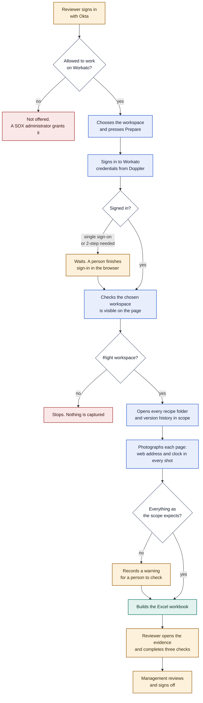
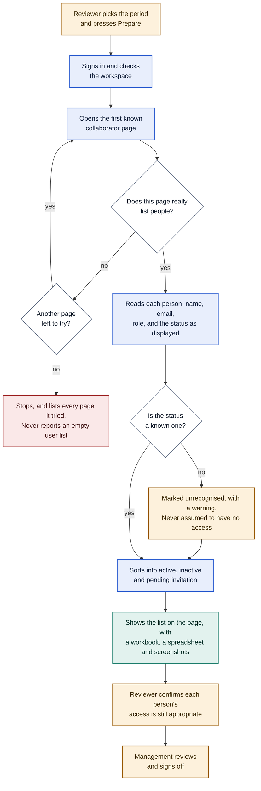

# How Workato evidence is collected

For anyone reviewing or signing off this evidence who does not work on the code.
Two SOX controls are prepared from Workato. Below is what the application does on
its own, and the points where it stops and waits for a person.

**It is read-only.** It navigates and photographs. It never starts, stops, edits,
creates or deletes anything in Workato.

Colours in both diagrams:

| | |
|---|---|
| blue | the application does this |
| amber | a person must do this |
| green | evidence produced |
| red | stops rather than guess |

## Change management — CM-02, monthly

Every screenshot is a whole-screen capture, so the web address and the clock appear
in the picture itself — the evidence shows where a page came from and when, not only
what it said.

**The wrong workspace means no evidence at all.** The workspace you chose is
confirmed visible on each page before anything is photographed. Evidence from the
wrong workspace would look completely normal and describe the wrong set of recipes,
so the run stops instead.

**Warnings must be resolved before sign-off.** When a folder cannot be reached, or
holds fewer recipes than the scope says it should, the run records a warning and
carries on. The screenshots are kept and flagged. A clean run and a run with
warnings never look the same.

**A spreadsheet decides what is in scope.** One row per recipe with a Capture Yes/No
column. A recipe found in Workato but missing from the sheet is reported as a
warning — never captured quietly, never skipped quietly.

## User access review — UA-04, quarterly

The list is a snapshot taken on the day it runs, labelled with the review period.
Workato does not publish a historical roster, so it evidences access as it stood
when the capture ran.

**An unfamiliar status is never read as "no access".** Workato shows a state per
person — active, invited, suspended, deactivated — worded differently depending on
the plan. The wording is recorded exactly as displayed and the verdict worked out
separately. Anything that cannot be interpreted is flagged for a person, because
under-counting who has access is the one mistake a user access review must not make.

**An empty list is never presented as an answer.** If no page qualifies as a genuine
list of people, the run fails and names every page it opened. "No users found" and
"we could not find the user list" are different statements, and only one of them is
ever made.

## What a completed run hands you

| | |
|---|---|
| Excel workbook | one tab per control area, every screenshot embedded beside its web address and timestamp |
| Screenshots | whole-screen captures, each showing the web address and the clock, downloaded together |
| Capture manifest | `manifest.json` — the address, timestamp and description behind every picture |
| User list | for the access review: `users.csv`, and the same list on screen sorted into active, inactive and pending |

The application organises evidence. It does not reach a conclusion: the three
preparer checks and management sign-off are performed by people, and any warning a
run records has to be resolved before that sign-off.
